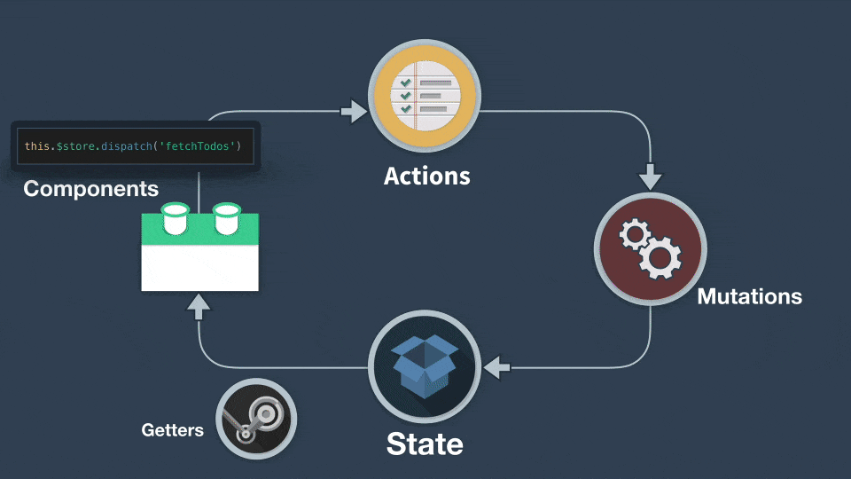

# Vuex State Management Example

This project demonstrates **state management** in a Vue 3 application.

Vuex provides a **centralized store** for all components in your application, making state changes predictable and easier to debug, especially in medium-to-large apps.

---

## 🚀 Features
- **State** → holds the data (`count` in this example).
- **Mutations** → synchronous functions to update the state.
- **Actions** → call mutations (can be asynchronous).
- **Getters** → compute derived state (like computed properties).
- **Modules** → structure the store for bigger apps.

---

## State Management Flow
1. **State**: The single source of truth (e.g., `count`).
2. **Getters**: Access and compute derived state.
3. **Mutations**: Synchronous changes to the state.
4. **Actions**: Asynchronous operations that can commit mutations.
5. **Components**: Dispatch actions and read state via getters.

NOTE: Difference between Mutations and Actions:
- **Mutations**: Must be synchronous. Directly modify the state.
- **Actions**: Can be asynchronous. Commit mutations.

1. Button click (+) → calls increment() (from component).

2. increment() (mapped to action) → calls Action: increment.

3. Action: increment → calls commit('increment').

4. Mutation: increment → updates state.count++.

5. Getter: getCount → re-computes the value.

UI ({{ count }}) → re-renders with the updated value.

---

## Example to demostrate Vuex
This example includes:
- 3 Counter card using vuex store
- Increment and Decrement buttons to update the count in the store
- Display the count from the store and shows the same count in all the 3 counter cards

